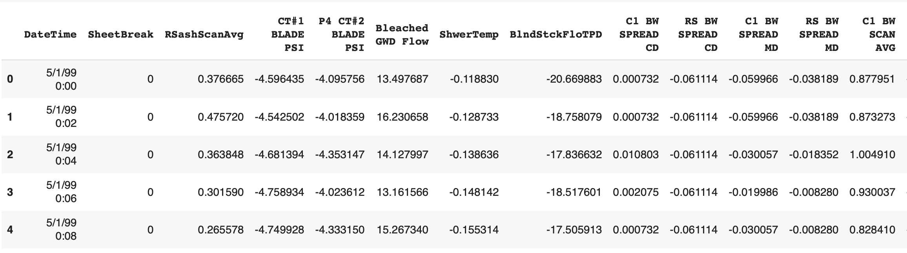

# Setup and Problem Dataset

Code repository of the book, *Deep Learning and Rare Event Prediction*, to be released in July 2020.

---
Created and maintained by,

**Chitta Ranjan, Ph.D.**

[mailto](mailto:cran2367@gmail.com): <cran2367@gmail.com> 

[LinkedIn](https://www.linkedin.com/in/chitta-ranjan-b0851911/): [www.linkedin.com/in/chitta-ranjan-b0851911/](https://www.linkedin.com/in/chitta-ranjan-b0851911/)

---

### Load data 

Download a rare event data set paper sheet-break data from [here](https://docs.google.com/forms/d/e/1FAIpQLSdyUk3lfDl7I5KYK_pw285LCApc-_RcoC0Tf9cnDnZ_TWzPAw/viewform), and save the data in the 	`/data/` directory within your work directory.

```
import pandas as pd

df = pd.read_csv("data/processminer-sheet-break-rare-event-dataset.csv")
df.head(n=5)  # visualize the data.
```


### Basic pre-process

```
# Hot encoding
hotencoding1 = pd.get_dummies(df['Grade&Bwt'])
hotencoding1 = hotencoding1.add_prefix('grade_')
hotencoding2 = pd.get_dummies(df['EventPress'])
hotencoding2 = hotencoding2.add_prefix('eventpress_')

df = df.drop(['Grade&Bwt', 'EventPress'], axis=1)
df = pd.concat([df, hotencoding1, hotencoding2], axis=1)

# Rename response column name for ease of understanding
df = df.rename(columns={'SheetBreak': 'y'})  
```